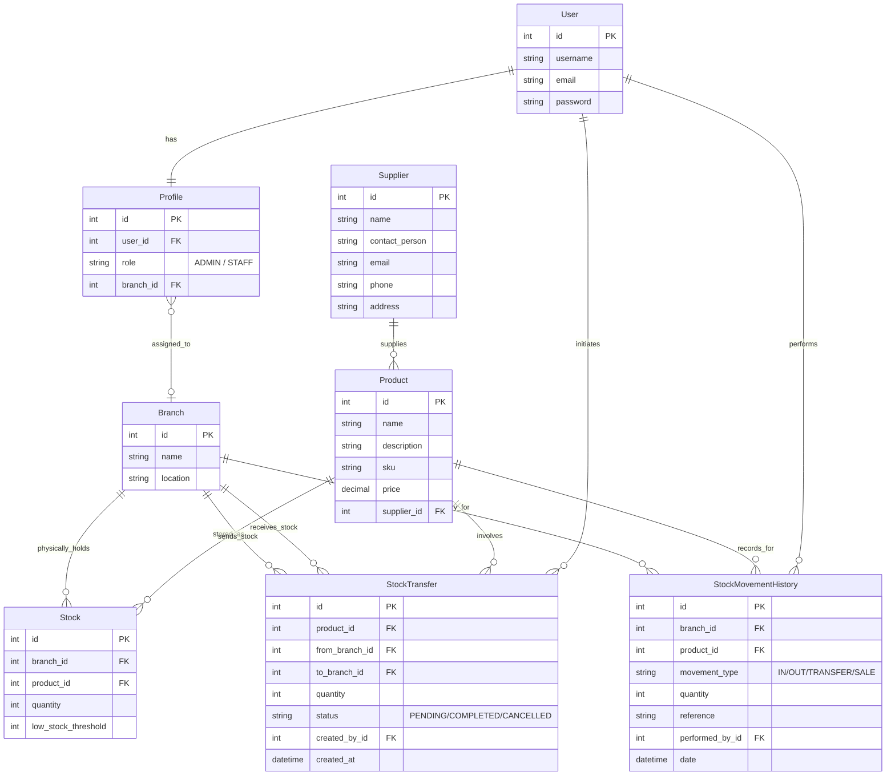
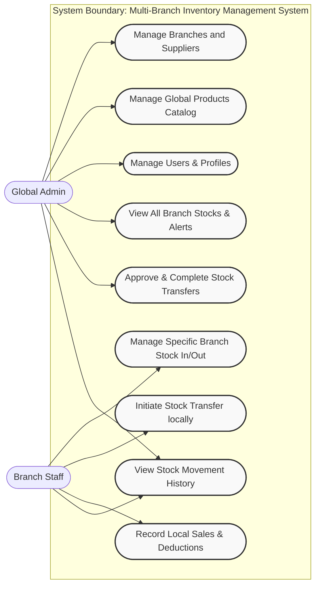
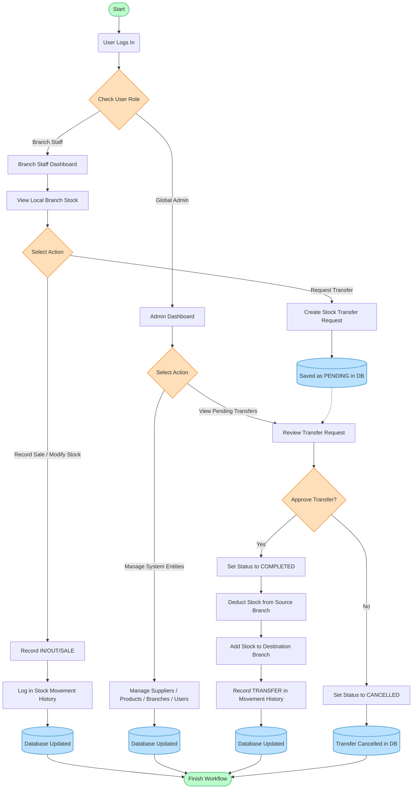
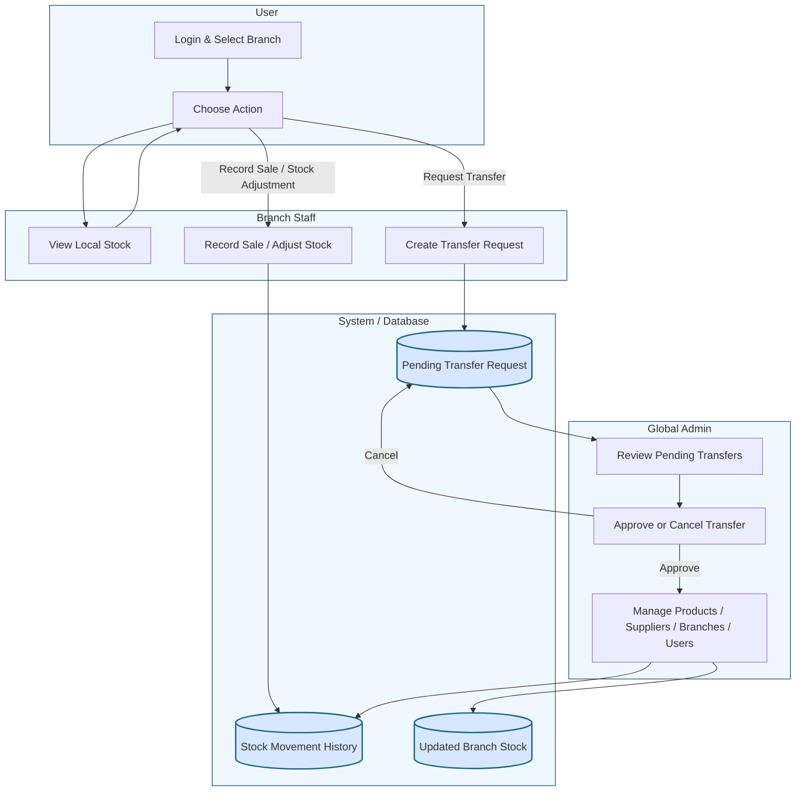

# Multi-Branch Inventory Management System Diagrams

Based on the system's current database models and backend structure, here are the diagrams requested: an Entity-Relationship Diagram (ERD), a Use Case Diagram, and a systematic Flowchart representing the core logic of the system.

## 1. Entity-Relationship Diagram (ERD)

This ERD maps out the relationships between the database tables (Models) defined in the Django backend. The core entities include User Profiles, Branches, Suppliers, Products, and the tracking of Stocks and their Movements.



---

## 2. Use Case Diagram

This Use Case diagram highlights the different interactions the actors (`Global Admin` and `Branch Staff`) can have with the inventory system.



---

## 3. System Process Flowchart

This flowchart demonstrates the central process path for a user logging into the system, and navigating either through Branch Staff workflows (like recording a sale or requesting a stock transfer) or Global Admin workflows (approving transfers and managing global entities).



---

## 4. Swimlane Diagram

This swimlane diagram separates the system process into lanes for the User, Branch Staff, Global Admin, and the System/Database. It highlights how transfer requests and stock updates flow between the actors and the backend.


```
